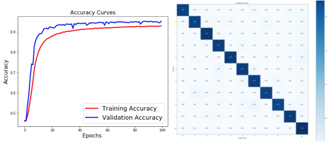

Detection and Recognition of the House Numbers
==============================================

## Synopsis

This project is my take on recognizing house numbers on the streets using Machine Learning. This project utilizes several methods from Computer Vision, Deep Learning and Computer Science in general, including:

 - Noise reduction
 - Image pyramid
 - Convolutional Neural Networks
   + Dropout
   + Max-pooling
   + Transfer-learning
   + etc...
 - Non-maximum suppression
 - etc...
 
## Data

For training CNN I'm using [SVHN](http://ufldl.stanford.edu/housenumbers/) dataset that comes with labeled house numbers. After a little bit preprocessing I had plenty of sample images of all 10 digits that come from the street numbers and even images of non-digits.

## Training

I used following CNN architechture and trained it on SVHN data feeding occasionally modified pictures (rotated, scaled, etc..) for more resilient recognition on testing set and IRL (i.e. avoiding overfitting).

After training for ~100 epochs network was finally ready for real-life application. And based on testing results it should have had decent classification accuracy.

## Results

After integration of the CNN into numbers detection and recognition pipeline I could apply it to real-life pictures and video that I took in my neighboorhood.

Video: [**YouTube** :movie_camera:](https://youtu.be/r2tf0E-BPXs)

## Details

For more detailed overview of the project please see the [Report](Report.pdf)

## How to run

 Libs requirements: 
  - tensorflow
  - numpy
  - Pillow

 Input: images 1.jpg, 2.jpg, 3.jpg, 4.jpg, 5.jpg in the input folder

 Run: execute `python run.py` in the terminal

 Output: 1.png, 2.png, 3.png, 4.png, 5.png images in the output folder with green bounding boxes and labels next to them added

## Code

 - *detect.py*: includes function for number detections
 - *run.py*: executes detection process on images and video frames
 - *model1.h5*: keras model file with model structure and weights
 - *FreeSerif.ttf*: font used by Pillow to add labels on output images
 - *mat2json.py*: converts Matlab format dataset metadata into json format
 - Notebooks (requires additional jupyter library installed for viewing and matplotlib for execution):
    + *prepare_data.ipynb*: processes SVHN data into dataset ready for CNN training. Data has to be predownloaded into data folder and processed using mat2json.py script
    + *modeling.ipynb*: creates custom CNN model and trains it
    + *prediction.ipynb*: prototype notebook for number identification
    + *modeling_vgg.ipynb*: modeling experiments with VGG16 network
